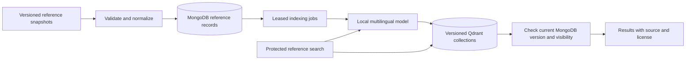

# Phase 3: public reference knowledge base

Implemented on 1 October 2026. MongoDB remains the source of truth. Qdrant stores
rebuildable vectors for public skills, occupations and locations. No candidate
profile, CV, live offer or company record is indexed in this phase. Recruiter
visibility rules and job/candidate matching belong to Phase 6.



## Data coverage

The committed 29 September snapshot normalizes to **51,921 records**, with no
rejected rows. The [normalization manifest](../data/knowledge_base/2026-09-29/normalized_manifest.json)
records source-file hashes, archive-member encodings, exact counts and coverage.

| Source | Canonical records | Limits |
|---|---:|---|
| ESCO | 11 skills, 4 occupations | Screened IT sample, not the full taxonomy. Upstream edition remains unknown; source labels/translation review is pending. Irrelevant React/property-development search hits are excluded. |
| O*NET 31.0 | 1,016 occupations, 8,753 distinct software labels | 31,821 software/occupation associations retained as evidence. Software IDs are explicitly derived from exact labels, not invented upstream concept IDs. US reference data does not measure Tunisian demand. |
| ROME 4.0, version 61, 26M06 | 1,911 occupations, 35,595 competencies/knowledge items | Archive `version.txt` confirms the edition. Occupation profiles retain appellation IDs and source relationships; all 12 JSON members are verified. Ancillary hierarchies remain in the original archive. |
| GeoNames TN | 4,631 locations | Populated/administrative features, including historical places. Feature codes remain distinct; these are not 4,631 cities. Governorate-name curation is still needed for Phase 6 filters. |

Raw downloaded files are checked against the existing availability log before
normalization. Derived selections receive their own hashes in the manifest. ROME
uses strict UTF-8 decoding with a Windows-1252 fallback; independently mixed UTF-8
fields are repaired only when a lossless round trip succeeds. Source bytes remain
unchanged. Invalid labels are reported as rejected rows; malformed JSON, missing
schema fields, checksum mismatch or conflicting identities abort normalization.
Any rejected row blocks the entire import before MongoDB writes begin.

Every record carries its original/derived source ID, source URL, source edition,
snapshot, evidence file and SHA-256, license name/link and attribution. Search
returns these credits. See the [source report](knowledge-base-sources.md) for reuse
terms and exclusions. Exact reviewed aliases distinguish ReactJS/React.js/React
from broader frontend development and from reacting to situations. No cross-source
concept merging or percentage compatibility claim is made.

## Embedding contract

The initial model is
[paraphrase-multilingual-MiniLM-L12-v2](https://huggingface.co/sentence-transformers/paraphrase-multilingual-MiniLM-L12-v2):
384 dimensions, Apache-2.0, multilingual, attention-mask mean pooling and L2
normalization. We use the
[Xenova ONNX conversion](https://huggingface.co/Xenova/paraphrase-multilingual-MiniLM-L12-v2/tree/2c4055b12046f11709e9df2c122e59ffbdc2f900)
at immutable revision `2c4055b12046f11709e9df2c122e59ffbdc2f900`, with the
quantized model (118,308,126 bytes) and tokenizer (17,082,913 bytes). Both have
pinned SHA-256 checksums. Downloads happen only through the explicit setup command;
API/worker startup verifies local files and never downloads weights.

Inference runs locally on CPU using ONNX Runtime. Groq and Gemini remain the
generation providers; neither is used as an embedding fallback. No API quota is
needed to embed reference data or search it. The collection fingerprint includes
artifact hashes, dimension, 128-token limit, pooling, normalization, prefix policy
and chunk/pipeline version. Runtime packages are locked in `uv.lock`. Changes to
any embedding contract require a new generation and matching query deployment.

Texts are split into bounded chunks using the actual pinned tokenizer; text over
the token limit cannot be silently truncated. Queries are capped at 500 characters
and must fit a single 128-token chunk. Scores are cosine similarity, never a
candidate compatibility percentage. French/English/Arabic smoke tests establish
basic cross-language behavior; a human-labeled recruitment retrieval evaluation
is still required in Phase 6.

The full local smoke run found Python first for the English/French queries and
second for the Arabic query; ReactJS found React first. A bare `Sfax` location
query returned the exact city third, behind two approximate matches. Phase 6
must add exact-name lookup and strict geographic constraints before using this
retrieval path to filter offers or candidates.

## Local setup

```powershell
uv sync
docker compose -p sid-phase2 -f compose.mongodb.yml up -d --wait
docker compose -p sid-phase3 -f compose.qdrant.yml up -d
```

Set the following locally in `.env`, or as environment variables in the current
terminal. On the actual platform use the existing database, after confirming its
connection and collection names. The database below is only the local Phase 3 demo.

```dotenv
MONGODB_URI=mongodb://127.0.0.1:27018/?replicaSet=rs0&directConnection=true
MONGODB_DATABASE=sid_phase3_dev
QDRANT_URL=http://127.0.0.1:6335
QDRANT_API_KEY=
EMBEDDING_MODEL_DIRECTORY=.models/multilingual-minilm
EMBEDDING_THREADS=2
INDEXING_BATCH_SIZE=16
KNOWLEDGE_MAX_CONCURRENT_QUERIES=2
```

Qdrant is pinned to `qdrant/qdrant:v1.19.1`, verified against the
[official release](https://github.com/qdrant/qdrant/releases/tag/v1.19.1).
The development database ports bind to loopback and persist in Docker volumes.
Production requires separately configured service access/authentication, backups
and capacity tests; the single-node development services do not claim HA.

```powershell
uv run python -m app.knowledge.cli download-model
uv run python -m app.knowledge.cli normalize
uv run python -m app.knowledge.cli import
uv run python -m app.knowledge.cli rebuild
```

`rebuild` prints the new generation name. Use that exact value below:

```powershell
uv run python -m app.knowledge.cli worker --drain
uv run python -m app.knowledge.cli status
uv run python -m app.knowledge.cli reconcile sid_kb_REPLACE_WITH_GENERATION
uv run python -m app.knowledge.cli promote sid_kb_REPLACE_WITH_GENERATION
```

`worker` without `--drain` polls continuously. Run workers in separate processes
to increase throughput, within available CPU/RAM. Model input and Qdrant upserts
are batched; MongoDB keeps an independent lease/fence and version for every job.
Increase throughput only after observing queue age, CPU, memory and search latency.
`--drain` stops when no claim is currently available; delayed retries or another
worker's live lease may remain. Check `status` and require all generation jobs done.

Import is resumable and idempotent: identical source content produces no new
version/job, even after a visibility change. Updated content preserves revocation
and tombstones. Imports do not infer deletion from missing rows in a partial or
new snapshot. Explicit operator deletion is available below; a future full-source
replacement policy needs independent completeness/release validation.

## API

Run `uv run fastapi dev` after setup. Both endpoints require the existing
`X-Service-Key` trusted-backend credential:

- `POST /api/v1/knowledge/search`, example:
  `{"query":"développement web Python","kind":"skill","limit":5}`.
  Optional `source`: `esco`, `rome`, `onet`, `geonames`; optional `kind`: `skill`,
  `occupation`, `location`. Limits are 1–10. Candidate/private filters are rejected.
- `GET /api/v1/knowledge/status` verifies the active MongoDB generation and Qdrant
  embedding contract, without embedding or AI generation calls.

Results contain source labels, descriptions, aliases, attribution/provenance and
similarity. GeoNames results also include feature/country/admin codes and public
coordinates, so administrative and historical features remain distinguishable.
Qdrant payloads contain only IDs, versions, chunk number, source and
kind. Content is hydrated from `sid_kb_records` only after checking current public
visibility, non-deletion, version/hash and the published index's exact point IDs.
The fixed collection prevents a vector pointing at a Phase 2 profile from exposing
it. Access decisions reflect the MongoDB validation read for that request.

Missing/corrupt model artifacts prevent startup. During requests, missing
configuration, missing generation, incompatible model/collection and
database/Qdrant outages fail closed with controlled 503 responses. Token overflow
returns 422. Concurrent searches are bounded; cancelled requests keep their slot
until native inference and associated work actually finish. Shutdown drains those
tasks before closing the database/HTTP client.

The main `/health/ready` still covers generation/provider quotas and platform
identity. Use the protected knowledge status for this reference-only feature.
Main-platform login integration is pending and remains disabled by default.

## Consistency, deletion and recovery

Dedicated collections: `sid_kb_records`, `sid_kb_imports`, `sid_kb_catalog`,
`sid_kb_generations`, `sid_kb_indexed`, `sid_index_jobs`. Main platform records
and the Phase 2 outbox/task types are not consumed. Every canonical mutation and
its jobs commit in one MongoDB transaction. Workers use server-clock leases,
heartbeats, bounded retries and fencing tokens. Queue claims first recover expired
work, then claim pending work using dedicated covering sort indexes; they do not
scan/sort the entire pending queue. Run normal API/worker startup or
`uv run python -m app.db.init` to create these additive indexes before deployment.

Vector identities include collection generation, record ID, version and chunk.
A late old write cannot overwrite a newer point. Qdrant writes are confirmed before
MongoDB publishes the index head and acknowledges jobs in a fenced transaction.
One lost lease rolls back the whole batch publication. Stale events are acknowledged
without reinstating older content. Cleanup is limited to the event's version or
earlier, so late cleanup cannot delete future versions.

```powershell
uv run python -m app.knowledge.cli revoke "SOURCE:KIND:SOURCE_ID"
uv run python -m app.knowledge.cli delete "SOURCE:KIND:SOURCE_ID"
uv run python -m app.knowledge.cli retry-failed sid_kb_REPLACE_WITH_GENERATION
```

Revocation/deletion changes the MongoDB version immediately; new searches omit
the obsolete vector before asynchronous physical cleanup. Tombstones retain the
public reference audit information. Re-import does not restore access. A crash
after a Qdrant write may leave unsearchable old points; `reconcile` removes stale,
revoked or orphan points. There is no distributed MongoDB/Qdrant transaction.
Bounded overfetch/deduplication can return fewer results while stale points await
cleanup or many chunks occupy the top hits. Hybrid retrieval/reranking is Phase 6.

`rebuild` registers a shadow generation and seeds all MongoDB heads. Subsequent
imports also enqueue into every active/building generation. An interrupted seed
can be resumed with `seed GENERATION`; it can create a missing collection only for
a registered matching build. `promote` requires completed seeding, no unfinished
or failed jobs, matching versions/hashes for every visible record, and exact vector
count. A catalog epoch protects against writes during verification. Cutover is one
atomic MongoDB active-pointer transaction; API requests use that physical collection.
There is no independently managed Qdrant alias to get out of sync. Retired collections
remain available for operator review; the CLI never deletes them automatically.

Recovery can always rebuild a new generation from canonical MongoDB records.
`snapshot GENERATION` also creates a native server-side Qdrant collection snapshot;
the integration suite tests recovery from its server-local file. Export these files
off the Qdrant volume for backups and retain MongoDB backups/catalog and model
artifacts separately. Collection snapshots do not restore MongoDB's active pointer.
Use a matching server version and validate the collection fingerprint after restore.
See [Qdrant snapshots](https://qdrant.tech/documentation/operations/snapshots/) and
[collection management](https://qdrant.tech/documentation/manage-data/collections/).

## Verification

Offline tests never download a model or call Groq/Gemini. Integration databases
and Qdrant collections have random `sid_test_` names; only those test resources
are deleted by fixtures. Main application credentials are not used.

```powershell
$env:SID_TEST_MONGODB_URI="mongodb://127.0.0.1:27018/?replicaSet=rs0&directConnection=true"
$env:SID_TEST_QDRANT_URL="http://127.0.0.1:6335"
$env:SID_TEST_EMBEDDING_DIRECTORY=".models/multilingual-minilm"
uv run pytest -q
uv run ruff check app tests
uv run ruff format --check app tests
```

Coverage includes deterministic normalization/counts, source evidence/credits,
UTF-8/Windows-1252/mixed fields, invalid rows, aliases vs broader skills, dimensions,
idempotent/concurrent imports, parallel batched workers, exact leases/rollback,
update/delete/revocation, duplicate/out-of-order events, a real write/update race,
private-record isolation, atomic cutover races, logical rebuild, native snapshot
restore, FastAPI lifespan/auth/filter/error handling, cancellation admission and
real multilingual CPU inference. Production topology, demand and retrieval quality
remain Phase 6/7 evaluations.

Local verification on 1 October 2026: **140 tests passed**, lint/format checks
passed, and the entire snapshot was imported/indexed in `sid_phase3_dev`.
All 51,921 jobs finished with zero failures; parity verification activated a
55,035-point index. Five real FastAPI searches checked English/French/Arabic
skills, Sfax locations and ReactJS, with source/license metadata intact. No live
generation provider was called. These are local functional checks, not a
production throughput or relevance guarantee.
