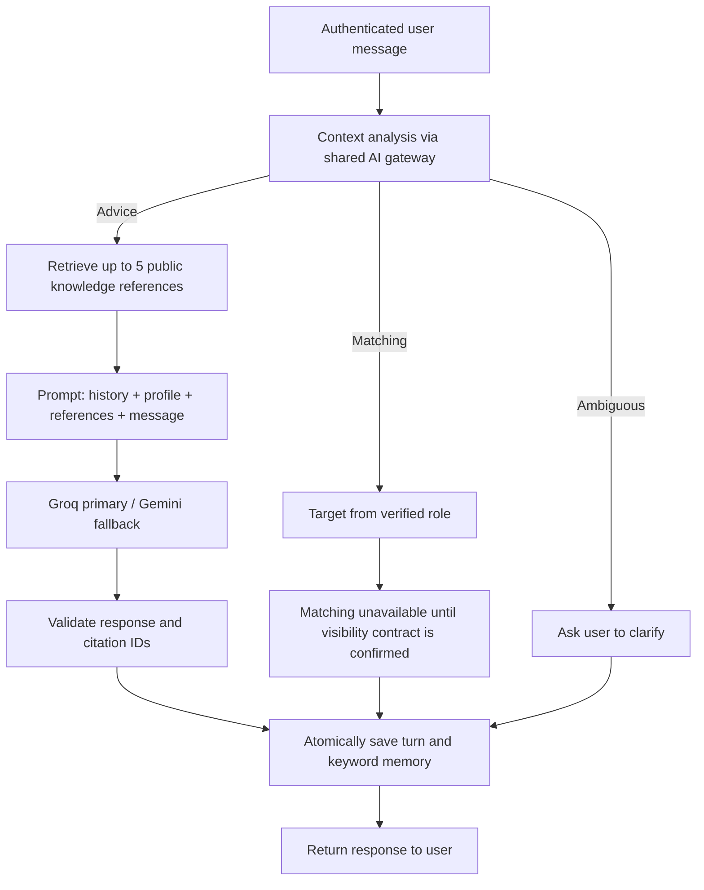

# Pipeline review and implementation

Reviewed against the supplied diagram on 4 October 2026. The existing Groq primary /
Gemini fallback remains the generation gateway; the diagram's Gemini 2.0 Flash label
does not change the configured models. Matching is explicitly disabled at the user's
request until job visibility and candidate discovery rules are confirmed.

## Review of the starting state

| Diagram stage | Starting state | Delivery in this iteration |
|---|---|---|
| User prompt and context agent | Individual feature endpoints, no conversation entry point | Private conversations and schema-validated advice/matching/clarification routing |
| User type | Platform identity/role adapter already implemented; live login integration pending | Target determined from verified identity: candidate → offers, recruiter → candidates |
| Knowledge RAG | Public reference search and local embeddings implemented | Advice retrieves up to five hydrated MongoDB/Qdrant references |
| Prompt builder | Letter-specific prompt only | Current message, last six turns, saved keywords, optional validated profile, retrieved references |
| LLM | Groq/Gemini with shared circuits and quotas | Both routing and advice use that gateway; invalid schema/citation IDs can trigger fallback |
| Keywords / memory | No conversation memory | Up to eight explicit terms; successful turn, history and memory committed together |
| Response | Feature-specific results | Typed status, text, reference provenance, routing/generation provider metadata |
| Matching vectors and top five profiles/offers | No private candidate or job vector indexes | Disabled with `matching_unavailable`; no fabricated matches or compatibility percentage |
| Profile context | Versioned profiles; Phase 4 CV review was local and uncommitted | Existing Phase 4 work retained; candidate profile must be owned and validated at its pinned version |

The knowledge base currently contains ESCO, ROME, O*NET and GeoNames references.
It is not a collection of live offers, candidate records, company intelligence, or a
complete corpus of career guidance. Advice coverage and relevance are limited by
those sources. More reviewed guidance documents and live answer evaluation are
needed before promising general career coaching.

## Runnable path



This is conversation orchestration, not an autonomous tool-calling agent. No
conversation operation can modify a profile, accept a CV, approve a letter, send a
message or submit an application. Existing explicit confirmation endpoints retain
those responsibilities. Phase 5 submission integration remains separate work.

## API and startup

Use the main-platform identity adapter from [Phase 2](phase-2.md). All routes fail
closed until that verifier is supplied. Candidates and recruiters have private
conversations; admins do not get a bypass. Recruiter conversations are also scoped
to the currently verified company membership.

1. Start MongoDB and Qdrant using the existing compose files.
2. Configure provider credentials and account limits locally, plus the existing
   embedding directory and `QDRANT_URL`. Import/index reference data as in
   [Phase 3](phase-3.md).
3. Run the FastAPI app with `create_app(verify_user_id=...)` integrated into the
   existing authentication system. There is no new token format or browser service key.

Create a conversation with `POST /api/v1/conversations`:

```json
{"language": "fr", "profile_id": "owned-sid-profile-id", "profile_version": 1}
```

The profile ID/version pair is optional for candidates and must be omitted for
recruiters. Recruiter context contains only the verified company ID and bounded
company name, not arbitrary company database fields. A profile change invalidates
its conversation context; create a new conversation referencing the newly validated
profile version. Existing conversation history remains readable by its owner.

Send a message with `POST /api/v1/conversations/{id}/turns` and a unique
`Idempotency-Key` header:

```json
{"expected_revision": 0, "message": "Comment améliorer mes compétences Python pour un stage PFE ?"}
```

The result includes the committed revision and a response with:

- `status`: `answered`, `clarification_required`, `insufficient_knowledge`, or
  `matching_unavailable`;
- `intent`, rewritten retrieval `query`, bounded `keywords`, and server-selected
  matching `target` where relevant;
- `text`, up to five `references` with original source/license metadata and a `cited`
  flag, plus separate routing and answer-generation provenance;
- `results: []` while matching is disabled and `submitted: false`.

Read the private history with `GET /api/v1/conversations/{id}`. Use the returned
revision for the next turn. There are at most 50 turns per conversation; start a new
conversation at that limit. Only the last six turns enter model prompts.

## Consistency and limits

An in-flight turn holds a 120-second MongoDB lease. The response pipeline has a
90-second deadline, with a 30-second retrieval timeout and the gateway's existing
per-call/provider bounds. A second simultaneous turn receives 409. Lease expiry
allows recovery after a process crash; a late worker cannot commit over its successor.

Successful responses, immutable turn history, revision and replacement keyword
memory commit in one MongoDB transaction. Replaying an identical completed request
with its original key returns the stored turn without calling AI again. Reusing the
key for another payload fails. Provider failure, cancellation or a stale profile
does not advance revision/memory. Provider charges after failed/crashed requests
cannot be undone, and an uncommitted request may call AI again when retried.

The role always comes from server authentication, never model output. Candidate
profiles are checked before generation and guarded again in the commit transaction.
Account role/company membership is rechecked before commit. Matching never reads
candidate/job collections for retrieval while disabled.

Memory accepts only proposed terms appearing in the current message or existing
memory, with duplicate/email/long-number rejection. It is a small private topic
memory, not a new candidate qualification source. Model interpretation of intent,
negation and preference changes still needs human evaluation. Profile and history
text may contain personal data and are sent to configured providers; the pilot's
provider-data and conversation-retention review remains outstanding.

Citation validation proves that the cited IDs were retrieved. It does not prove
that every sentence is supported. Prompt injection resistance and factual answer
quality require live evaluation; no such quality claim is made by the mock tests.
Stored history is a historical response snapshot and is not automatically rewritten
when a reference is later changed/revoked. Account-wide deletion/retention policies
remain part of production readiness.

## Tests and next work

Verified 4 October 2026: **188 tests passed**, including the real disposable MongoDB
and Qdrant integration suites and local embedding-model smoke test. Ruff lint and
format checks passed. The new conversation suite contributes 18 tests; all generation
responses in this run were mocked, with no live Groq/Gemini quality evaluation.

The conversation suite checks role-controlled routing, disabled matching, source
provenance, history/memory, idempotency, isolation, leases, profile changes, provider
failure, cancellation, atomic rollback, and citation-triggered gateway fallback.
MongoDB tests use disposable databases; model calls are synthetic.

```powershell
$env:SID_TEST_MONGODB_URI='mongodb://127.0.0.1:27018/?replicaSet=rs0&directConnection=true'
uv run python -m pytest tests/test_conversations.py -q
```

Next matching work requires confirmed offer publication and candidate discovery
fields, source update/deletion rules, strict location/contract filters, separate
candidate/job vector collections, and human-labelled relevance tests. Keep it
disabled until those contracts are confirmed. The main-platform login adapter,
frontend, live provider access/quality evaluation and application submission are
also still pending integrations.
